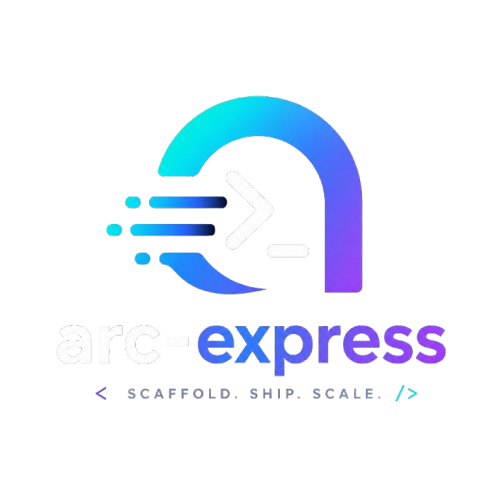

<p align="center">
  <a href="https://www.npmjs.com/package/create-arc-express">
    
  </a>
</p>


<p align="center">
  <strong>Express API scaffolding with structure, choices, and no framework lock-in.</strong>
</p>

<p align="center">
  Choose TypeScript, authentication, database tooling, testing, Docker, and CI during setup.
</p>

<p align="center">
  <a href="https://github.com/abdullahiqbal93/arc-express/actions/workflows/ci.yml"></a>
  <a href="https://www.npmjs.com/package/create-arc-express"></a>
  <a href="https://www.npmjs.com/package/create-arc-express"></a>
  <a href="LICENSE"></a>
</p>

<p align="center">
  <code>npx create-arc-express@latest my-api</code>
</p>

## Overview

`create-arc-express` is an interactive project generator for Express.js APIs. It starts with a clean backend scaffold, then adds selected feature packs such as authentication, database tooling, testing, Docker, and CI.

The package is intentionally a generator, not a framework. Generated applications are plain Express projects with familiar dependencies, readable structure, and their own setup README.

## Create a Project

```bash
npx create-arc-express@latest my-api
```

Then start the generated app:

```bash
cd my-api
cp .env.example .env
npm run dev
```

## Feature Packs

- JavaScript or TypeScript
- Session-based or JWT authentication
- Sequelize, Prisma, or Drizzle
- PostgreSQL or MySQL
- Google OAuth, SMTP email, file uploads, CSRF protection, and audit logging
- Docker Compose, Vitest, and GitHub Actions

## Design Goals

- Generate a backend that is useful on day one.
- Keep every optional feature explicit.
- Prefer standard Express patterns over hidden framework behavior.
- Leave the generated project easy to inspect, edit, test, and deploy.

## Requirements

Node.js 18 or newer is required.

## Contributing

Contributions are welcome. Please read [CONTRIBUTING.md](CONTRIBUTING.md) before opening a pull request.

## Security

Please report security vulnerabilities through GitHub Security Advisories instead of public issues.

## License

`create-arc-express` is open-source software licensed under the [MIT license](LICENSE).
